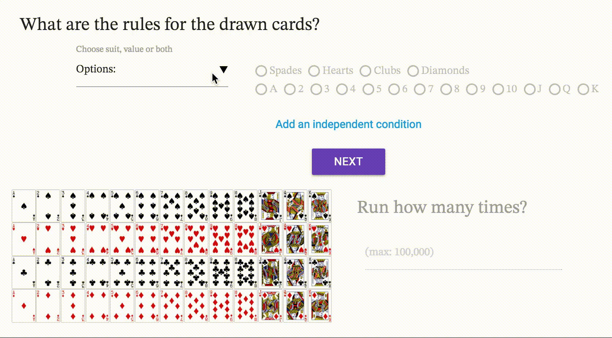

# shuffle/repeat

## Description

This site is meant as a teaching tool for probabilities of randomly occurring events. By repeating a simple random process over multiple, user-defined iterations, it demonstrates key principles of probability theory and allows for easy visualization.

## Features

#### Configuration

The configuration page requires two user inputs: rules and number of repetitions.

The rules are further specified to two parts: user must specify suit or value (or both) which will enable the appropriate rows of radio buttons.

Updating the values will result in the preview grid display changing to reflect the provided rules.

Rules can be added as many as the user wants.

Number of repetitions require a number between 1 and 100,000. Performance will depend on the user's system configuration.

Ready button will display a confirmation modal which summarizes the criteria provided by the user.

#### Probabilities

After the confirmation modal, the user is led to the probabilities page. This page is divided into two sections.

##### Calculated probability
Given the submitted inputs, this section will display the mathematically calculated probability of the event occurring.

##### Measured probability
This section will record the measured probability of the simulation that the program will run by randomly picking a card from the deck.

###### Controls:
Interval – slider controls the interval between each card, in 0.25 second intervals between 0.25 and 1.5 seconds.

Start/Pause – buttons will start/stop the repeated rendering.

Next – button will manually show the next card on each click. This button is only enabled while the interval repetition is paused.

Finish - button will complete the given repetitions without displaying the results, skipping over to the final run.

#### About
Separate 'about' page with reference links is provided in the footer of the page.

## Tech

Following technologies have been used in the development of this product:

- Materialize
- jQuery

- Deck of Cards API [(link)](http://deckofcardsapi.com/)

The site utilizes a Materialize framework. Rendering, calculations and other functionalities utilizes native JavaScript with additional DOM interactions using jQuery.

Additionally, the following style elements have been incorporated:
- Material Icons
- STIX font [(link)](http://stixfonts.org/)

## Further development
