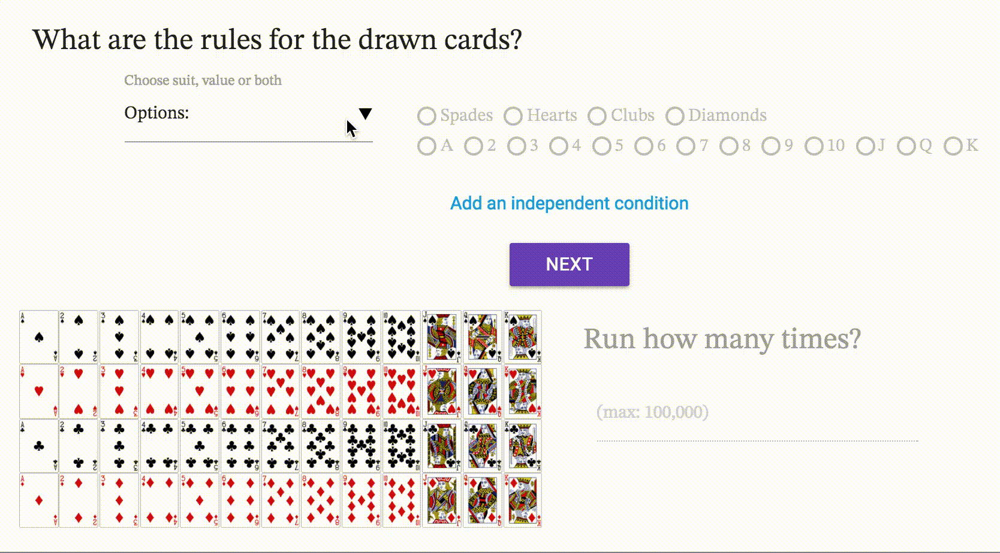
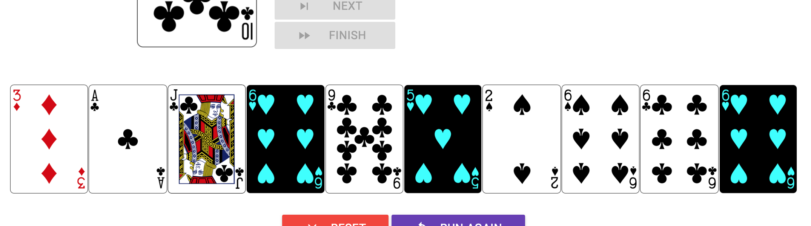

# shuffle/repeat
Web project by **Brian J. Lee**

December 11, 2016

## Description

shuffle/repeat is *quite literally* what this site does: it shuffles a deck of cards, picks a card and repeats.

While this process may seem trivial, when repeated over large enough numbers, it reveals a useful pattern of a probabilistic model that is otherwise difficult to replicate in real life.

The site is meant as a teaching tool for probabilities of randomly occurring events. By repeating a simple random process over multiple, user-defined iterations, it demonstrates key principles of probability theory and allows for easy visualization.

The clean layout, simple setup and fast-running code is well suited for uses in classroom demonstrations or self-guided study of probability.

## Features

#### Configuration

The configuration page requires two user inputs: rules and number of repetitions.

The rules are further specified to two parts: user must specify suit or value (or both) which will enable the appropriate rows of radio buttons.

Updating the values will result in the preview grid display changing to reflect the provided rules.

Rules can be added as many as the user wants.

Number of repetitions require a number between 1 and 100,000. Performance will depend on the user's system configuration.

Ready button will display a confirmation modal which summarizes the criteria provided by the user.

#### Probabilities

After the confirmation modal, the user is led to the probabilities page. This page is divided into two sections.

##### Calculated probability
Given the submitted inputs, this section will display the mathematically calculated probability of the event occurring.

##### Measured probability
This section will record the measured probability of the simulation that the program will run by randomly picking a card from the deck.

###### Controls:
**Interval** – slider controls the interval between each card, in 0.25 second intervals between 0.25 and 1.5 seconds.

**Start/Pause** – buttons will start/stop the repeated rendering.

**Next** – button will manually show the next card on each click. This button is only enabled while the interval repetition is paused.

**Finish** - button will complete the given repetitions without displaying the results, skipping over to the final run.

###### Update (12/12/2016)

Site now displays the 20 latest cards drawn by the simulation.

#### About
Separate 'about' page with reference links is provided in the footer of the page.

## Tech

Following technologies have been used in the development of this product:

- Materialize
- jQuery

- Deck of Cards API [(link)](http://deckofcardsapi.com/)

The site utilizes a Materialize framework. Rendering, calculations and other functionalities utilizes native JavaScript with additional DOM interactions using jQuery.

Previously, the site planned on using dedicated technology for rendering math elements such as MathJax or MathML notations. This plan was abandoned due to the costs involved in system performance and the lack of universal support between browsers.

Additionally, the following style elements have been incorporated:
- Material Icons
- STIX font [(link)](http://stixfonts.org/)

## Further development

There is some potential for future development to this project. One possibility is to consider other similar models of random events such as coin tosses or dice rolls.

Another possibility is adapting the same simulation to apply to other similar concepts of probability and statistics such as probability distributions or probability mass functions. This would augment the expected primary use case to a more expanded learning tool.
